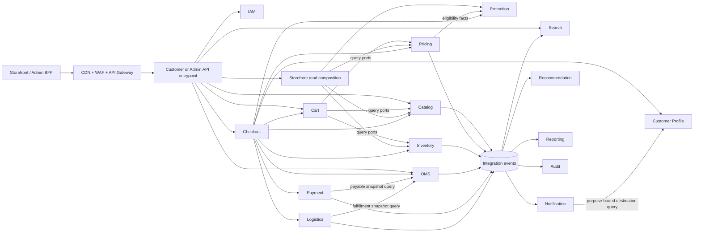
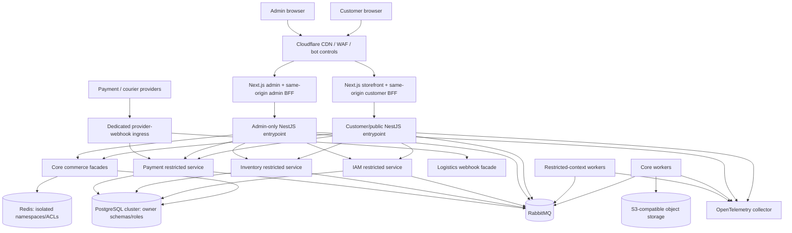

# System Architecture Baseline

Status: Accepted  
Date: 2026-09-02  
Scope: Logical architecture and delivery constraints; no runtime implementation is implied.

## Architecture decision

Luic_Tech is a headless-capable modular monolith at the source, ownership, and release-governance level; it is not required to place every context in one operating-system process. Each bounded context has its own domain model, application interface, persistence adapter, migrations, database role, and integration contracts. Boundaries are designed so a context can change deployment shape without changing its consumers' business semantics.

Core contexts may use synchronous in-process ports where that preserves isolation and immediate consistency. IAM, Payment, and Inventory use restricted NestJS entrypoints, credentials, workers, and network/egress policy from the first production deployment because a shared-process compromise would expose every loaded secret. Cross-process ports use authenticated transport with the same contract semantics; durable integration events handle propagation and long-running workflows.

## Canonical bounded contexts

This list resolves the shorter and inconsistent module lists in the source prompts. Category and Product are capabilities inside Catalog. Identity and Customer Profile are separate because credentials and customer PII have different trust and lifecycle boundaries. Audit is an explicit platform context.

| Context | Responsibility | Owned data | Allowed collaborators |
| --- | --- | --- | --- |
| Identity & Access (IAM) | Customer/admin authentication, mobile OTP, MFA, sessions, token rotation, revocation/status distribution, roles, permissions, service principals | Subjects, OTP challenges, authenticators, token families, sessions, devices, roles, permissions, monotonic security versions | Customer/admin BFF login flows, local verifiers/introspection clients, external OTP/identity providers; publishes identity security events |
| Customer Profile | Customer identity-linked profile, addresses, preferences, authoritative communication consent, privacy requests, wishlist | Customer PII, addresses, preferences, consent history, privacy workflow, wishlist | IAM subject IDs; purpose-limited queries by Checkout/Notification; publishes privacy-safe profile events |
| Catalog | Product information management | Products, variants/SKUs, brands, categories, attributes, localized copy, SEO, asset metadata | Object storage adapter; publishes catalog events |
| Inventory | Available-to-promise and physical stock control | Warehouses, bins if needed, stock ledger, reservations, adjustments, thresholds | Catalog onboarding events; Checkout query/reservation ports; OMS targeted commands; publishes availability events |
| Pricing | Authoritative monetary calculation | Price books, base/sale/bulk prices, tax/VAT rules, quote breakdowns | Promotion evaluation port; Catalog identifiers |
| Promotion | Campaign and voucher eligibility | Campaigns, vouchers, rule definitions, usage limits, reservations, redemptions | Evaluates supplied facts; never reads Pricing or Cart storage |
| Search | Customer-facing discovery projection | Disposable search documents, analyzers, synonyms, index checkpoints | Consumes Catalog/Pricing/Inventory/Promotion events |
| Recommendation | Derived rankings and optional consent-aware personalization | Feature projections, candidate sets, model/rule versions; approved pseudonymous interactions only in a later phase | Baseline consumes public Catalog facts only; behavioral/popularity inputs require the consent-aware Analytics contract; never owns commerce truth |
| Cart | Guest and authenticated purchase intent | Carts, line intent, merge state, validation snapshots and timestamps | Catalog, Pricing, Inventory query ports |
| Checkout | Pre-order workflow orchestration and compensation | Checkout attempts, idempotency records, saga state | Customer, Cart, Catalog, Pricing, Promotion, Inventory, Logistics, Order, Payment ports |
| Order Management (OMS) | Commercial order record and lifecycle | Orders, immutable item/price/address/delivery snapshots, transitions, allocations, cancellations, returns | Checkout commands; exposes payable/fulfillment/ownership snapshots; consumes Payment/Inventory/Logistics facts; issues targeted lifecycle commands |
| Payment | Payment lifecycle and append-only finance ledger | Payment intents/attempts, provider references/tokens, immutable transaction/refund/reconciliation entries and derived balances | Checkout initialization, OMS payable query, OMS/Finance targeted refund commands, gateway adapters; no raw payment credentials |
| Logistics & Fulfillment | Delivery planning and carrier lifecycle | Packages, shipments, zones, rate quotes, tracking, delivery proof, COD remittance references | Checkout quote calls; OMS targeted shipment commands and fulfillment snapshot query; courier adapters |
| Notification | Transactional communication delivery | Registered templates, provider suppression and consent projections, delivery attempts | Consumes allowlisted events; resolves purpose-bound destinations through Customer Profile; calls SMS/email/push adapters |
| CMS | Editorial content outside product truth | Pages, banners, navigation, publication state, CMS asset metadata | Object storage adapter; publishes content events |
| Reporting | Operational and analytical read models | Denormalized projections, export state, warehouse feed checkpoints | Event-fed only; cannot mutate producer state |
| Audit & Compliance | Tamper-evident accountability projection | Append-only security, admin, and sensitive-business audit entries | Consumes owner-local sanitized audit-outbox records; never participates synchronously in the mutation transaction |

Platform capabilities such as edge routing, configuration, secrets, messaging, telemetry, feature flags, and storage adapters support the contexts but do not own commerce behavior.

## Boundary and dependency rules

1. A context exposes application ports and versioned contracts, not repositories or ORM models.
2. A context may synchronously call another context only through an explicitly listed query or command contract in [contract-catalog.md](contract-catalog.md).
3. Synchronous dependency cycles are prohibited.
4. Search, Recommendation, Notification, Reporting, and the central Audit projection are never required for a checkout or order commit to succeed. A critical mutation must still write its sanitized audit outbox record locally in the same transaction.
5. JWT signature/audience/expiry verification happens locally with trusted signing keys/JWKS. Authorization also checks a bounded-fresh IAM revocation/status projection; specified high-risk operations require live introspection. Protected requests do not call IAM merely for cryptographic verification.
6. OMS receives immutable snapshots and opaque references; it does not fetch mutable Catalog, Customer, or Pricing state after order creation.
7. Payment calls provider adapters, not OMS persistence. Logistics calls courier adapters, not OMS persistence.
8. Private domain events remain inside their owner. Only stable, minimized integration events cross context boundaries.
9. Static dependency rules and tests must reject imports from another context's domain, application implementation, infrastructure, migrations, or generated Prisma client.
10. Inside one process, the composition root injects private typed capabilities only into allowlisted callers. This plus static reachability identifies the in-process caller but is not a cryptographic security boundary; end-user/resource authorization still executes at runtime. Cross-process calls use audience-bound workload identity and mTLS where supported.

## Primary dependency view

Module-to-module arrows show permitted synchronous contract directions, not table access. External route ownership and durable targeted commands are cataloged separately in `contract-catalog.md`; unlisted synchronous module edges are denied. Each caller still needs an authorization policy and failure strategy.

## Persistence ownership

- Start with one managed PostgreSQL cluster for operational simplicity.
- Give every bounded context a dedicated PostgreSQL schema, migration history, least-privilege database role, and Prisma client generated from its owned model.
- Do not create cross-schema joins, foreign keys, triggers, shared tables, ORM relations, or repository imports.
- References to another context are opaque stable IDs. Display or historical data that must survive change is captured as an owned snapshot; query acceleration uses an event-built projection.
- Use application-generated UUIDv7 identifiers, `timestamptz` UTC timestamps, and explicit actor/correlation metadata.
- Represent money as signed 64-bit minor units plus ISO 4217 currency (`BDT` initially); never use floating point.
- Keep transactions local to one context. Cross-context work uses an idempotent saga/process manager with transactional outbox/inbox records and compensating actions.
- Use read replicas only for owner-approved stale reads. A replica does not make cross-context SQL acceptable.
- Database roles prevent accidental/cross-context SQL and reduce the blast radius of one restricted process. They do not protect credentials already loaded into a compromised multi-context process; restricted IAM, Payment, and Inventory deployments load only their own roles/secrets.

## Critical order workflow

The Checkout context owns orchestration, not commercial truth:

1. Authenticate the customer and authorize the selected address.
2. Load the server-owned cart and revalidate saleability.
3. Request a versioned, expiring Logistics quote using validated zone and package facts; Logistics is authoritative for the provider-neutral base delivery rate and ETA.
4. Request an authoritative Pricing quote that consumes the owner-issued delivery quote, applies Promotion and tax/VAT rules, and produces the single final payable total.
5. Reserve Inventory and any limited-use promotion with the checkout idempotency key. Reservation expiry must cover the declared payment deadline plus a bounded processing margin.
6. Create a `PENDING` order from immutable item, final-price, address, and delivery-quote snapshots.
7. Ask Payment to create a provider intent or COD ledger entry from the OMS-owned payable snapshot. The browser return carries only a one-time UI-resume state and never proves payment.
8. Persist a normalized payment outcome. The commit saga advances only when `paymentCommitmentSatisfied` is true: provider-executed/captured for prepaid methods or an explicitly accepted COD obligation. Authorization-only, browser-return, unknown, and unverified states are insufficient.
9. Have the Checkout process manager idempotently commit Inventory and Promotion reservations.
10. Only after every required commit succeeds may the process manager command OMS to confirm the order and publish `OrderConfirmed`. Logistics then receives a targeted shipment command; non-critical projections update asynchronously.
11. Payment failure/expiry cancels the pending order and releases reservations. A late success enters recovery rather than recreating reservations silently. If money succeeds but a reservation commit cannot, keep the order non-fulfillable in `PAYMENT_RECEIVED_STOCK_EXCEPTION`, reconcile/re-reserve or refund under approved policy, and audit the recovery; never claim confirmation.

Every step must tolerate retries. The process manager records forward progress and compensation; it never relies on a distributed database transaction. Broad integration facts inform consumers but never authorize a refund, stock movement, voucher change, privacy erasure, or shipment; an owner-authorized process manager issues a recipient-specific durable command for those effects.

## Runtime and deployment topology

- Storefront/admin BFFs, API entrypoints, restricted services, and workers are peer deployments that scale independently; APIs do not invoke workers directly.
- Customer and admin use distinct origins, same-origin BFF cookies, token audiences, CSPs, route registries, runtime identities, and access policy. The admin API is not a route prefix enabled by customer credentials.
- IAM, Payment, and Inventory entrypoints/workers run in restricted network segments, load only their owner credentials, expose allowlisted contracts, and use explicit egress policies.
- Provider callbacks use a dedicated narrow ingress and owner-specific verification before entering a durable owner inbox. It cannot call general customer/admin APIs.
- Datastores and broker live on private networks. Production should prefer managed PostgreSQL, Redis, RabbitMQ, object storage, and key management.
- Local development uses containers. Production remains Kubernetes-ready, but Kubernetes is adopted only with an operating model, ownership, budgets, and runbooks.
- Media uploads use short-lived presigned URLs, private-by-default objects, validation and malware scanning before publication, and CDN delivery.
- Provider webhooks terminate at narrow, rate-limited, authenticated, replay-protected endpoints and enter the same idempotent owner contracts as polled reconciliation.

## Event reliability model

- The producer stores its state change and outbox message in one local transaction.
- A relay publishes versioned integration events to RabbitMQ topic exchanges.
- Consumers never rely on broker delivery order. Consistent aggregate routing is an optimization only; handlers enforce event ID deduplication, aggregate version/state preconditions, gap quarantine, and owner-query recovery.
- For a database-only effect, the consumer stores its inbox record with the local projection/action in one transaction. For an external effect, it stores the inbox plus a local intent/work item first, calls the provider later with an idempotent merchant reference, and marks/reconciles the outcome durably.
- Retry policies use bounded exponential backoff and jitter. Permanent failures enter a dead-letter queue with alert ownership and a replay runbook.
- Delivery is at least once; handlers must be idempotent. Business correctness must not depend on broker exactly-once claims.
- Event schemas are backward compatible within a major version and are tested against registered consumers before release.
- Event payloads contain the minimum necessary data and avoid PII; consumers query an authorized owner contract when fresh sensitive data is genuinely required.
- Outbox, inbox, retry, raw-provider quarantine, and DLQ records have owner-specific access, encryption, payload allowlists, bounded retention, and audited replay/deletion.

## Scaling path

Scale stateless API/worker replicas and owner-specific database access first. Cache only measured hot reads with explicit invalidation. Begin Search with its own PostgreSQL full-text/trigram projection; move its implementation to OpenSearch/Elasticsearch behind the existing Search contract when relevance, language analysis, or load measurements justify it. Extract a bounded context only when team autonomy, workload isolation, risk isolation, or independent release pressure outweighs distributed-system cost.

Extraction preserves the published contract, moves the owner's schema and outbox, introduces authenticated network transport, runs compatibility tests, migrates data with dual-read/controlled cutover where necessary, and removes the in-process adapter after evidence confirms parity.

## Architecture risks and controls

| Risk | Control |
| --- | --- |
| A modular monolith degrades into shared internals | Nx dependency tags, package exports, database grants, architecture tests, and code ownership. |
| Synchronous checkout becomes fragile | Time budgets, idempotency, persisted saga state, compensations, circuit breakers, and reconciliation. |
| Eventual consistency confuses users | Explicit pending states, version/checkpoint metadata, UI messaging, and source-of-truth reads for commits. |
| PII leaks into projections or telemetry | Contract review, field allowlists, structured redaction, retention rules, and automated leakage tests. |
| Profile/OMS credentials share a Core-process blast radius initially | Separate roles, encryption, field policy, minimized entrypoint composition and audit; isolate either context when threat modeling, compliance, or incident evidence shows the residual risk is unacceptable. |
| Premature infrastructure raises cost | Add replicas, search engines, Kubernetes features, or separate services only against measured thresholds and an owner. |
| Provider instability stalls orders | Adapters, timeouts, circuit breakers, webhook plus polling reconciliation, and operator-visible recovery queues. |

## Validation gate for implementation

An implementation task may begin only when it names its owning context, owned data, published/consumed contracts, authorization policy, failure and recovery behavior, observability, tests, and dependency-ready predecessor tasks.
